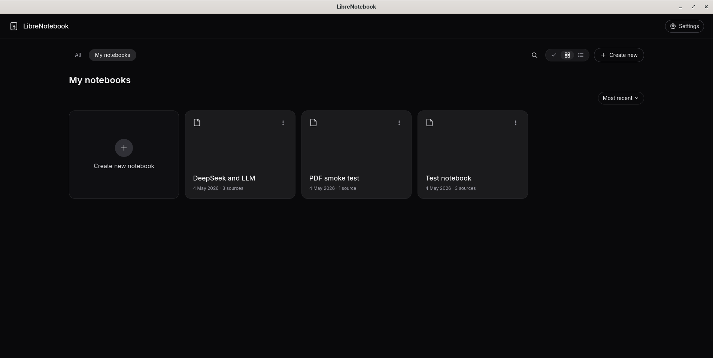
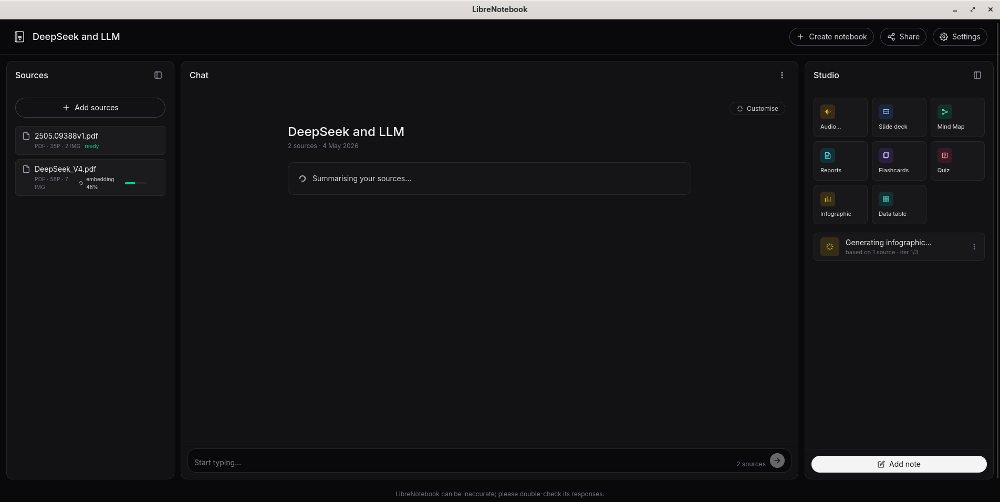

# LibreNotebook

> An open-source NotebookLM. Pick any AI provider you want — OpenAI-compatible API or a local Ollama — feed it sources, ask grounded questions, and generate Mermaid infographics. Built on Deno + Fresh + LangChain.js.

## Screenshots

| Main menu | Notebook view |
|-----------|---------------|
|  |  |

---

## Features

**Notebooks dashboard**
- Create, **rename** (inline), **delete** (with confirm), and sort notebooks
- Sort by *Most recent*, *Oldest first*, *A → Z*, *Z → A*

**Sources** — paste anything, retrieval is text-based but the LLM can look at images in-context when it has vision
- **Paste text** snippets
- **Fetch URL** — Mozilla **Readability** strips the page to its readable article, downloads inline images
- **YouTube** — `yt-dlp` pulls the video's transcript (manual subs preferred, auto-captions otherwise)
- **PDF upload** — Mozilla **PDF.js** extracts text + embedded raster images
- Per-source delete + status (`pending` → `ready` / `failed`) with a chunk-level progress bar
- Per-source favicon (Google `s2/favicons` for plain URLs, YouTube glyph for videos)

**Chat with your sources**
- NDJSON streaming chat with inline `[N]` citation badges
- Hover a citation → quick chunk preview
- Click a citation → drawer with the **full source** and the cited chunk highlighted in context
- Auto-generated **summary** + 3 clickable **suggested questions** every time you open a notebook
- Vision-aware context: when the LLM has vision (auto-detected for Ollama via `/api/show`, manual toggle for OpenAI), images extracted from the cited PDFs / webpages ride along on the chat request

**Studio (right pane)**
- **Mermaid Infographic** generator with a *Customise infographic* modal: language, orientation, visual style carousel, level of detail, free-form prompt
- ≥3 refinement iterations — each pass renders the diagram, screenshots the SVG to PNG, posts it back to a vision-capable LLM for critique, and emits an improved Mermaid block
- Studio item cards show in-flight generations as *"Generating infographic… based on N sources · iter 2/3"* and flip to a clickable card with a derived title once finished
- The final diagram lands as an assistant chat message with a fenced ` ```mermaid ` block that `MermaidView` renders inline

**Settings / providers**
- **OpenAI-compatible** (works with OpenAI proper, Together, Groq, vLLM, OpenRouter, …) and **Ollama** side-by-side
- **Test connection** lists every model the server exposes
- Searchable **Model dropdown** (filter as you type, accept any unknown value)
- **Auto-detect vision** for Ollama (probes `/api/show`'s `capabilities`); manual toggle for OpenAI
- Ollama **Auto context window** — at request time looks up the model's `model_info.<family>.context_length` and passes it as `numCtx`; or set a custom number
- **Re-embed** button (orange, with confirm) wipes the vector DB and re-embeds every source against the current embedding model
- **`.env` overrides** — operators can pre-pin providers via `LLM_*` / `EMBEDDING_*` env vars; the form renders read-only when locked

**Multi-user (server mode)**
- Optional **email + password sign-in** via [Better Auth](https://better-auth.com/), enabled by `MULTI_USER=1`
- **SMTP** for password-reset / email verification (any SMTP server — OAuth providers can be added via Better Auth plugins)
- **Per-user data** — every notebook, source, vector, and chat lives under `<dataDir>/users/<userId>/`

**Persistence**
- Filesystem JSON under `.data/` (settings, notebooks, sources, messages, studio items, jobs)
- Per-notebook vector store as a JSON file using LangChain's `MemoryVectorStore` (drop-in for `@lancedb/lancedb` later — the abstraction in `src/lib/vectorstore.ts` is a single file)
- Logs at `.data/librenotebook.log` (rotating, 5 MB) plus colourised console — see *Logging* below

**Tech stack**
- [Deno](https://deno.com/) 2.x runtime · [Fresh](https://fresh.deno.dev/) (Vite-based) · Preact + signals · [LangChain.js](https://js.langchain.com/) · [Mermaid](https://mermaid.js.org/) · [Mozilla Readability](https://github.com/mozilla/readability) · [pdfjs-dist](https://github.com/mozilla/pdf.js) · [yt-dlp](https://github.com/yt-dlp/yt-dlp) · [Neutralinojs](https://neutralino.js.org/) for the desktop window

---

## Quick start (development)

```bash
# 1. Clone
git clone https://github.com/impulse/LibreNotebook
cd LibreNotebook

# 2. Run the Fresh dev server
deno task dev
#    → http://localhost:5173

# (optional) Run inside a Neutralino desktop window
deno task neu
```

The first time you visit `/` you'll be sent to `/onboarding`. Configure your LLM and embedding providers, click *Test connection*, then *Save and continue*.

### Required dependencies (for full functionality)
- **`yt-dlp`** — required to ingest YouTube transcripts. Install with one of:
  ```
  pip install --user yt-dlp     # ~/.local/bin/yt-dlp
  pacman -S yt-dlp              # Arch
  apt install yt-dlp            # Debian / Ubuntu
  brew install yt-dlp           # macOS
  ```
  If the binary lives somewhere unusual, point `$YT_DLP_PATH` at it. The server also auto-probes `~/.local/bin`, `~/bin`, and `/usr/local/bin`.
- **`dpkg-deb`** (and `librsvg2-bin` for `rsvg-convert`) — required to build a `.deb`. Install with one of:
  ```
  pacman -S dpkg librsvg        # Arch
  apt install dpkg-dev librsvg2-bin   # Debian / Ubuntu
  brew install dpkg librsvg     # macOS
  ```
  Not needed at runtime — only `deno task build:deb` calls them.

### Optional dependencies
- **A Chromium-class browser for tests** — Puppeteer downloads its own by default. If you'd rather use a system Chrome, set `CHROME_PATH=/usr/bin/google-chrome` (or `/usr/bin/chromium`).

---

## Run modes

After a release build (see *Building*), the `librenotebook` launcher accepts:

```bash
librenotebook                     # ← default: window mode (desktop)
librenotebook window [--port N]   # boots the server, then the desktop window pointing at it
librenotebook server [--port N]   # headless server only — open the printed URL in any browser
```

When you install the `.deb` or run the AppImage, the **default action is windowed** — the Neutralino native binary opens a desktop window pointing at a server it just started in the background. Use `server` mode when you want to expose the API to a real browser (or another device on the LAN with `HOST=0.0.0.0`).

Both honour:
- `PORT` — listening port (default `5173`)
- `HOST` — bind address (default `127.0.0.1`; `0.0.0.0` for LAN / Docker)
- `YT_DLP_PATH` — absolute path to a `yt-dlp` binary if it isn't on `PATH`
- `LIBRENOTEBOOK_DATA_DIR` — override the user-data dir (default: per-OS platformdir)
- `LOG_LEVEL` — one of `DEBUG`, `INFO` (default), `WARN`, `ERROR`
- `LOG_FILE=0` — disable the `librenotebook.log` file handler

See [`.env.example`](.env.example) for every variable LibreNotebook reads.

---

## User-data directory

LibreNotebook stores notebooks, sources, vectors, and chat history in a
per-OS directory:

| OS      | Default                                            |
|---------|----------------------------------------------------|
| Linux   | `$XDG_DATA_HOME/librenotebook` (or `~/.local/share/librenotebook`) |
| macOS   | `~/Library/Application Support/librenotebook`      |
| Windows | `%APPDATA%\librenotebook`                          |

The first time a newer build runs, any legacy `./.data/` next to the
project source is migrated to the new location automatically
(idempotent, never overwrites). Override with `LIBRENOTEBOOK_DATA_DIR`.

---

## Multi-user mode (server only)

Set `MULTI_USER=1` in `.env` and the server-mode build requires
sign-in. Each user has their own notebooks, sources, and chat history —
data is scoped to a per-user subdirectory under the data root.

Auth runs on **[Better Auth](https://better-auth.com/)** with email +
password. The handler is mounted at `/api/auth/*`. There are
`/signin` and `/signup` pages with simple forms.

Required `.env`:

```env
MULTI_USER=1
BETTER_AUTH_SECRET=<openssl rand -hex 32>
BETTER_AUTH_URL=http://localhost:5173

# SMTP (for password-reset / email-verification messages). Optional —
# without it, sign-up still works but password reset is disabled.
SMTP_HOST=mail.example.com
SMTP_PORT=587
SMTP_USER=postmaster@example.com
SMTP_PASS=...
SMTP_FROM="LibreNotebook <no-reply@example.com>"
```

Window mode (the desktop binary) ignores `MULTI_USER` — it's a
single-user desktop app.

---

## Operator-pinned providers (`.env`)

Operators shipping a preconfigured deployment can pre-fill the LLM and
embedding providers via `.env`. When `LLM_BASE_URL` + `LLM_MODEL` (and
the embedding equivalents) are set, the corresponding fields render
read-only on the onboarding form with a `Set via .env` pill — end users
can't edit them or leak the API key.

```env
LLM_PROVIDER=openai            # "openai" or "ollama"
LLM_BASE_URL=https://api.openai.com/v1
LLM_API_KEY=sk-...
LLM_MODEL=gpt-4o-mini
LLM_HAS_VISION=true            # OpenAI only; Ollama auto-detects
LLM_NUM_CTX=auto               # auto | <int> (Ollama only)

EMBEDDING_PROVIDER=openai
EMBEDDING_BASE_URL=https://api.openai.com/v1
EMBEDDING_API_KEY=sk-...
EMBEDDING_MODEL=text-embedding-3-small
```

---

## Docker

The repo ships a `Dockerfile` (multi-stage, Deno + Vite) and a
`docker-compose.yml` that wires up persistence, env injection, and a
healthcheck.

```bash
cp .env.example .env
# Edit .env — at minimum set MULTI_USER=1, BETTER_AUTH_SECRET, SMTP_*
docker compose up -d
# → http://localhost:5173
```

`docker compose` mounts a named volume at `/data` so notebooks, vectors,
and the auth DB survive `down` / restarts. Add a host bind mount
instead (`./data:/data`) if you'd rather see them on disk.

To run a one-shot container directly:

```bash
docker build -t librenotebook .
docker run --rm -p 5173:5173 \
  -e MULTI_USER=1 \
  -e BETTER_AUTH_SECRET=$(openssl rand -hex 32) \
  -e BETTER_AUTH_URL=http://localhost:5173 \
  -v librenotebook-data:/data \
  librenotebook
```

The image bundles `yt-dlp` so YouTube ingest works inside the
container without any extra setup.

---

## Building

Both packages bundle a self-contained `librenotebook-server` (Deno-compiled from the Vite-built `_fresh/server.js`) plus the Linux Neutralino native binary, dispatched by the launcher above.

### `.deb`

```bash
deno task build:deb
# → dist/librenotebook_<version>_<arch>.deb
```

Requires `dpkg-deb` (any Debian / Ubuntu derivative ships it) and `rsvg-convert` (`apt install librsvg2-bin`). Install with `sudo dpkg -i dist/librenotebook_*.deb`. Reverse-deps the package declares: `ca-certificates`, `libgtk-3-0`, `libwebkit2gtk-4.1-0 | libwebkit2gtk-4.0-37`. `Recommends: yt-dlp` so apt nudges users to install it.

### AppImage

```bash
deno task build:appimage
# → dist/LibreNotebook-<version>-x86_64.AppImage
```

Downloads `appimagetool` to `dist/appimagetool` on first run. On systems without FUSE 2 the script auto-passes `--appimage-extract-and-run`. Make the output executable and run:

```bash
chmod +x dist/LibreNotebook-*.AppImage
./dist/LibreNotebook-*-x86_64.AppImage window     # desktop
./dist/LibreNotebook-*-x86_64.AppImage server     # headless
```

### AppDir only (no packaging)

```bash
deno task compile
# → dist/AppDir/usr/bin/{librenotebook, librenotebook-server, librenotebook-window}
```

Useful for poking at the unpackaged layout. Run `dist/AppDir/AppRun server` or `…/AppRun window` to exercise it directly.

---

## Tests

```bash
deno task test
```

Three Puppeteer specs (`tests/01_onboarding.test.ts`, `tests/02_notebooks.test.ts`, `tests/03_chat.test.ts`) drive the dev server in headless Chromium. They spin the server up automatically; set `BASE_URL=http://localhost:5173` to reuse a running one. They mock the LLM / yt-dlp / settings APIs via `page.setRequestInterception` so no real provider is hit.

---

## Logging

`src/lib/logger.ts` wraps Deno's [`@std/log`](https://jsr.io/@std/log) with two handlers:

- Coloured console at `$LOG_LEVEL` (default `INFO`)
- Rotating file at `.data/librenotebook.log` (5 MB × 3 backups) — disable with `LOG_FILE=0`

Log lines look like:

```
14:22:37 INFO  [http        ] POST /api/notebooks/ab/sources 202 18ms
14:22:37 INFO  [webpage     ] Readability extracted {"url":"https://…","chars":12345,"images":3}
14:22:39 INFO  [rag         ] RAG retrieval {"notebookId":"ab","k":4,"sources":["src-1","src-2"]}
```

---

## License

LibreNotebook is released under the **GNU Affero General Public License v3.0 or later** (AGPL-3.0-or-later). See [LICENSE.md](./LICENSE.md).
